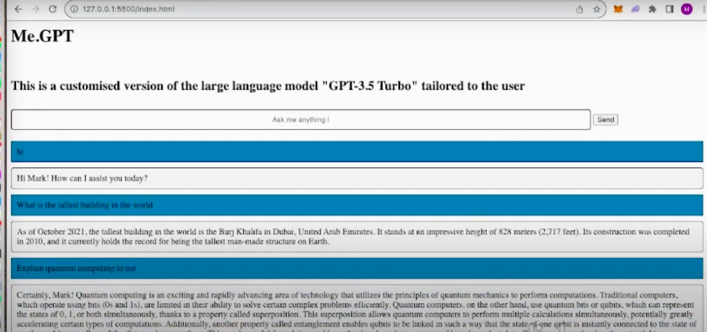

# Personal Website

Personal Website I use to check my timetable , the weather for limerick , When my assingments are due and interface with a personalized version of ChatGPT

This is not a portfolio website where I show off projects, This was built for my own personal needs 

[View the site ][(https://callanmark.github.io/home.html)
API interactivy with the chatbot is turned off

# To do 
- Renable gpt with env variable 
- Display exercise data properly 
- Add diet menu upload 
- write add to csv functions 
- design display database 